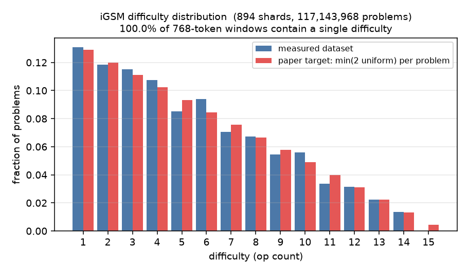

# Measuring the realized difficulty distribution

[`visualizations/dataset_difficulty.py`](../visualizations/dataset_difficulty.py) reports what a packed iGSM parquet dataset contains by measuring the distribution of problem difficulty (op-count) and how much difficulty is mixed inside each 768-token training window. It complements [`doc/data_generation.md`](data_generation.md), which describes the expected layout.

## How it recovers difficulty

Shards store only `input_ids`; difficulty is not recorded.  
But it is recoverable exactly: a problem's `n_op` equals the number of `;` tokens (id `26`) in its solution region `[223]…[224]` (each operation is one `;`-joined clause — this holds even when several operations share one sentence, since each still emits its own `;`).  
→ Verified against `problem.n_op` on 1400 regenerated problems (incl. at least 200 op=15 problems)

Each shard is `concat(problems) → chunk(768)`, so flattening its windows in row order rebuilds the
original stream and every problem is parsed properly. Shards are processed one per worker process to reduce RAM usage.

## How to run

```bash
uv run python -m visualizations.dataset_difficulty \
    --data-dir .../data/igsm_train_117M \
    --out visualizations/dataset_difficulty.png \
    --json visualizations/dataset_difficulty.json --workers 12
```

Options:
* `--data-dir` location of the packed iGSM dataset (parquet shards),
* `--out` location of the output PNG plot,
* `--json` location of the output JSON data,
* `--workers N` pool size, default `min(12, cpus)`,
* `--stride N` scan every Nth shard, for a quick approximate run,
* `--max-shards N` limit total shards scanned, for a quick approximate run,
* `--show` launches a matplotlib window with the plot, for interactive inspection.

The full 894-shard exact scan of `igsm_train_117M` takes ~1 min on 12 workers.

## Example result (`igsm_train_117M`, all 894 shards, exact)



```
n_problems: 117,143,968
single_op_window_fraction: 1.0   # every window has ONE difficulty
problems per op:
  1: 15,335,158
  2: 13,893,411
  3: 13,500,204
  4: 12,582,737
  5:  9,961,327
  6: 11,009,910
  7:  8,257,420
  8:  7,864,227
  9:  6,389,691
  10: 6,553,524
  11: 3,932,119
  12: 3,669,980
  13: 2,621,414
  14: 1,572,846
  15:         0
```

**Reading:** the difficulty roughly matches the paper's per-problem `min(2 uniform)` target closely with two differences:
- **Every context window is a single difficulty.** This dataset was generated with one worker, so a whole shard (~131,070 problems) is one op-count; the model never sees difficulties interleaved.
- **Difficulty is drawn only ~894 times** (once per shard), not per problem. The hardest level (op 15) is feasible and *is* sampled at ~0.46% per shard, but 894 × 0.46% ≈ 4 expected shards. This happened to be **0**, so op 15 is entirely absent and op 11–14 are rare. With true per-problem sampling (117 M draws) op 15 would appear ~0.5 M times.

Both match the observed failure to generalize to harder problems: the model almost never sees the hard problems, and never sees difficulties mixed within a context. (See [`data_generation.md`](data_generation.md) for the layout mechanism and the shuffle/worker recommendations that avoid this.)  
**The 40% accuracy measured on op=15 problems was already OOD generalisation.**
