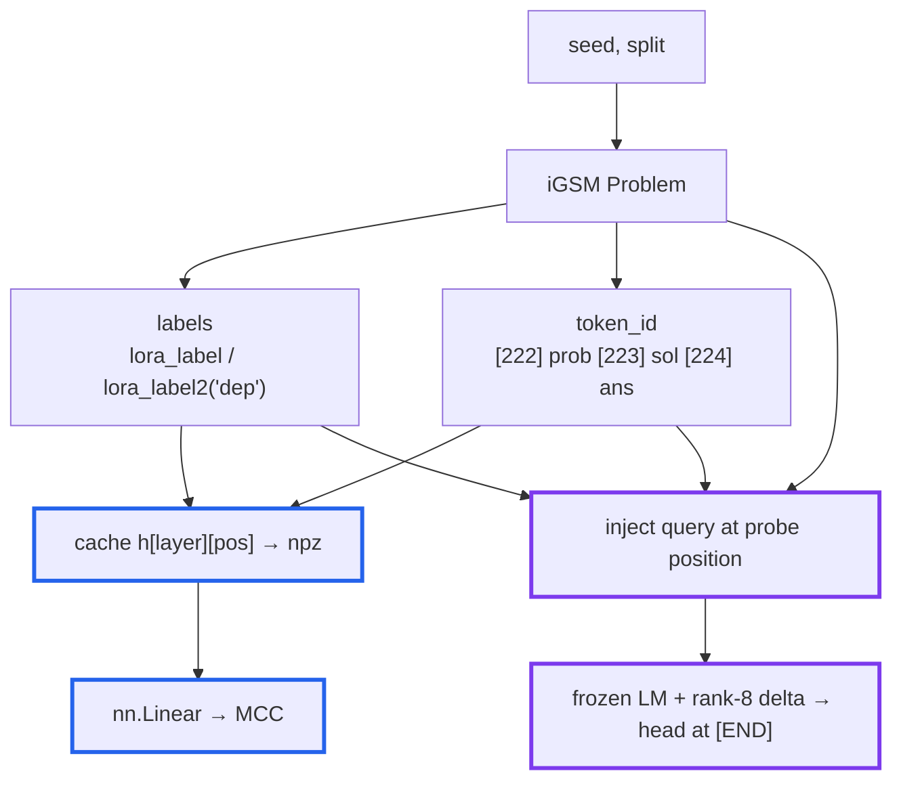

# Probing the iGSM model: linear probes & V-probes

Reference for `src/probe/`. For the conceptual version, see
[probe_guide_beginner.md](probe_guide_beginner.md). Reproduces the probing methodology of
*Physics of LMs Part 2.1* (https://dx.doi.org/10.2139/ssrn.5250629), §4.1, against our
GPT2-12-12+RoPE trained on iGSM-med.

## Module map

| File | Role |
|---|---|
| `labels.py` | Regenerate a problem from `(seed, split)`; ground-truth labels from `Problem.lora_label`; token-alignment metadata (`sol_bos_index`, `step_positions`, `problem_desc_end_index`). |
| `data.py` | Offline V-probe datasets: multiprocess generation into resumable parquet shards + metadata (`gen-data` CLI). |
| `extract.py` | **Linear probe** stage A: frozen forward passes, cache `(X, y, groups)` per layer to `.npz`. |
| `probe.py` | **Linear probe** stage B: `nn.Linear` on cached activations, group split, MCC. |
| `vprobe.py` | **V-probe** (§4.1): frozen LM + rank-8 embedding delta + linear head; trains through the model. |
| `evaluate.py` | Test-time evaluation: rebuild a saved probe from its run dir, predict on a held-out offline dataset, save per-row predictions + metrics into the run dir. |
| `report_dep.py` | Standalone interactive HTML report for `dep(A, B)`: dependency graph of predictions vs ground truth, pretrained/random toggle, confusion matrices. |
| `run.py` | Typer CLI: `extract`, `train`, `gen-data`, `vprobe`, `test`, `report-dep`. |

Test coverage (and the model-dependent code it deliberately skips): [../tests/README.md](../tests/README.md).

## Data flow



Blue = linear probe (cached, two-stage). Purple = V-probe (end-to-end, no cache).

## Ground-truth labels

From iGSM's `Problem` class (`iGSM/math_gen/problem_gen.py`):

- `lora_label(keys)` → `(1 + n_steps, n_param, n_keys)` for `nece, known, can_next, nece_next,
  val`. Axis 0 = reasoning step (row `i_` = state after the first `i_` solution sentences),
  axis 1 = `all_param`.
- `lora_label2('dep')` → `(n_param, n_param)` pairwise dependency matrix.

A parameter is a 4-tuple `(l, i, j, k)` over the layered category hierarchy:

- `l=0` **instance**: how many `N[i+1][k]` each `N[i][j]` has (direct edge).
- `l=1` **abstract**: how many `ln[k]` in total `N[i][j]` has (aggregate; multi-hop).
  `all_param` enumerates *every* candidate, mentioned or not.

Step alignment is verified against iGSM source: with `be_shortest=True`, solution sentences
follow `topological_order` (the order `lora_label` iterates) and each ends in a standalone `.`
(token 13). `_solution_step_positions` asserts the counts match, so tokenizer drift fails loudly.

## Probe positions (paper §4.1, Figure 13)

- `nece(A)`: end of the question = `sol_bos_index`.
- `dep(A,B)`: end of the **problem description**, before the question (the question tokens are
  dropped). Position from `problem_desc_end_index`, which asserts token alignment (stable on
  200/200 test problems).
- `known/can_next/nece_next/value`: end of each solution sentence = `step_positions[i_]`.

## Linear probe vs V-probe

The linear probe reads one hidden state and can't condition on *which* parameter is queried —
at the shared `sol_bos` position it is **degenerate by construction** (one vector, many labels)
and serves as the baseline. The V-probe injects the query into the input (`--target` picks the task):

```
nece(A):   [EOS] <problem+question tokens>  [START] <desc(A)> [END]
dep(A,B):  [EOS] <problem tokens, no ques.> [START] <desc(A)> [MID] <desc(B)> [END]
                                                                               ^ read last-layer h here
```

`[START]=225, [END]=226, [MID]=227` are byte-fallback ids that never appear in ASCII iGSM text
(0 occurrences in 300 problems). They are *not* untrained: weight tying collapses every
never-occurring row toward a single "never the next token" vector (norm 1.151 vs 1.5–2.9 for
the markers), so the rank-8 delta exists to give the markers usable representations.

**dep balancing:** the pair matrix is `n_param × n_param` and ~83% negative, so per problem we
keep all positive pairs and subsample an equal number of negatives (seeded by the problem seed →
deterministic). The dataset is ~50/50 by construction, so `--balance-classes` is *not* needed
and `acc_majority ≈ 0.5`.

**Trainables:** linear head + `delta_a (V×8, zero-init) @ delta_b (8×d, N(0,0.02))`. The LM
stays frozen and in eval mode; zero-init `delta_a` makes step 0 exactly the pretrained model.

**Controls** (both needed to interpret a score): majority-guess accuracy (`acc_majority`), and
the same procedure on a random-init LM (`--random-model`). Evidence = pretrained − random gap.

## Splitting: by group, not row

Examples cluster by problem (shared read position for the linear probe, shared prefix for the
V-probe), so a row-level split leaks correlated vectors into both halves and `*_val` just
measures memorisation. Both trainers split by **problem seed** (`groups` / `VProbeRow.group`);
an npz without `groups` falls back to a row split with a loud warning.

## Resource use (read before the V-probe)

The embedding delta sits at the **bottom** of the LM, so backprop traverses all 12 blocks and
autograd stores every block's activations — this, not the 0.41 M trainable params, is the cost.

**Windows hazard:** exhausting VRAM does *not* raise OOM. WDDM silently spills to shared GPU
memory (system RAM) and thrashes over PCIe — batch times creep up (we saw 1.4 → 15.6 s/batch)
and the desktop hangs. Mitigations, all on by default:

| guardrail | effect |
|---|---|
| `--vram-fraction 0.85` | allocator refuses to grow past the cap → clean OOM instead of spilling |
| `--grad-checkpointing` | recompute block activations in backward; ~30% slower, big VRAM saving |
| bf16 autocast | halves activation bytes |
| length bucketing | groups similar-length rows → peak tracks average length; avoids fragmentation |
| `MAX_SEQ_LEN = 1024` | drops pathological rows that would set a batch's memory |
| `--batch-size 8` (default) | the main VRAM knob |

Measured after fixes: **peak 3.56 GiB**, flat batch times, no spill. `peak_vram_gib` is in
every run's metrics — watch it. If you OOM, lower `--batch-size` first; don't raise
`--vram-fraction` above ~0.9.

## Metrics

- **MCC** (Matthews correlation): 0 = chance regardless of class balance, 1 = perfect;
  comparable across layers and targets.
- `*_train` vs `*_val` gap = memorisation check. The V-probe also reports plain accuracy for
  comparability with the paper's Figure 7.

## The model: download & loading (read first)

Use the HuggingFace checkpoint [m6rtine/gpt2-igsm-med](https://huggingface.co/m6rtine/gpt2-igsm-med)
(~501 MB), into the gitignored `final_models/`:

```bash
uv run python -c "from huggingface_hub import snapshot_download; snapshot_download('m6rtine/gpt2-igsm-med', local_dir='final_models/gpt2-igsm-med')"
```

Pass `--model-path final_models/gpt2-igsm-med` to the commands below. Do **not** use `AutoModel`
— it builds a stock GPT-2 with absolute positions and no RoPE; the probe CLIs load through our
`GPT2LMHeadModelWithRoPE` automatically.

**Why "inv_freq in place" matters:** `from_pretrained` builds on the meta device and skips
`__init__`, so the RoPE `inv_freq` buffer is only correct if *loaded from the checkpoint*.
Before the fix (ported from `qknorm` commit `4957741`) the buffer was non-persistent and came
out as uninitialized memory, silently corrupting the model. The HF checkpoint stores the 12
`inv_freq` tensors; `load_lm` / `load_frozen_model` verify them against the formula on load and
raise on mismatch, so a bad checkpoint fails loudly.

## Running

```bash
uv run python -m pytest .\tests\ -q                                    # tests
uv run python -m src.probe.run vprobe --model-path final_models/gpt2-igsm-med \
    --n-problems 16 --epochs 1 --batch-size 16                         # smoke (~30 s)
```

### nece(A)

**Always pass `--balance-classes`** (the ~80/20 imbalance otherwise collapses the probe to the
majority class, MCC ~0). Keep `--n-problems` and `--seed` identical between a run and its control.

```bash
uv run python -m src.probe.run vprobe --target nece --model-path final_models/gpt2-igsm-med --n-problems 500 --epochs 20 --batch-size 24 --balance-classes --seed 0
uv run python -m src.probe.run vprobe --target nece --random-model --n-problems 500 --epochs 20 --batch-size 24 --balance-classes --seed 0
```

### dep(A, B)

Same shape as nece, but **no `--balance-classes`** (balanced by construction) and ~5–10× more
rows per problem (one per sampled pair), so fewer problems give the same row count.

```bash
uv run python -m src.probe.run vprobe --target dep --model-path final_models/gpt2-igsm-med --n-problems 500 --epochs 20 --batch-size 24 --seed 0
uv run python -m src.probe.run vprobe --target dep --random-model --n-problems 500 --epochs 20 --batch-size 24 --seed 0
```

For row counts that avoid overfitting, generate offline first (multiprocess, resumable) and
pass `--data` instead of `--n-problems`:

```bash
uv run python -m src.probe.run gen-data --target dep --n-problems 20000 --workers 8 --model-path final_models/gpt2-igsm-med --out data/probe/vprobe_dep_test_20k
uv run python -m src.probe.run vprobe --target dep --model-path final_models/gpt2-igsm-med --data data/probe/vprobe_dep_test_20k
```

Tuning knobs: `--epochs`, `--lr`, `--weight-decay`, `--rank`, `--batch-size`,
`--balance-classes`. Diagnose on `mcc_train` first (can it fit at all?) before `mcc_val`; the
zero-init delta learns slowly through 12 frozen blocks, so if `--lr` stalls, raise it (e.g.
3e-3) or add epochs.

### Linear-probe baseline

Reads one shared position → degenerate for `nece` by construction (baseline, not expected to work):

```bash
uv run python -m src.probe.run extract --model-path final_models/gpt2-igsm-med --layer 6 --n-problems 1000 --out data/probe/nece_l6.npz
uv run python -m src.probe.run train --data data/probe/nece_l6.npz --balance-classes
```

## Viewing results

Each `vprobe` run creates `trained_probes/<timestamp>_<name>/` (printed as `run dir: ...`)
holding `config.json` (params + git commit), `train.log`, `metrics.json` (final + per-epoch
history), and `probe.pt` (trainable head + delta only; reload with `vprobe.load_vprobe`).
Compare a run's `metrics.json` against its random-model control manually. `trained_probes/` is
gitignored.

## Testing a trained probe (dep)

Training's `mcc_val` comes from the probe's *own* dataset: same seed range, and (for dep) the
artificially balanced 1:1 pair sample. The test pipeline answers the stronger question — fresh
problems from a **disjoint seed range**, on the **natural pair distribution** (every ordered
off-diagonal (A, B) pair, ~85–90% negative):

```bash
# 1. eval dataset: all pairs, seeds far above any training range (training used 0..499)
uv run python -m src.probe.run gen-data --target dep --dep-all-pairs --n-problems 200 --seed-start 1000000 --workers 8 --out data/probe/vprobe_dep_eval_200

# 2. evaluate both probes (writes <run-dir>/test_<dataset>/{predictions.parquet,metrics.json})
uv run python -m src.probe.run test --run-dir trained_probes/<pretrained-run> --data data/probe/vprobe_dep_eval_200
uv run python -m src.probe.run test --run-dir trained_probes/<random-run> --data data/probe/vprobe_dep_eval_200

# 3. interactive report (problem text + dependency graph + confusion matrices)
uv run python -m src.probe.run report-dep --pretrained-run trained_probes/<pretrained-run> --random-run trained_probes/<random-run> --data data/probe/vprobe_dep_eval_200 --out visualizations/dep_probe_report.html
```

Sizing: iGSM-med problems have 12–72 candidate params (~1,200 ordered pairs per problem on
average), so 200 problems ≈ 240k rows. `test` is inference-only (no-grad, bf16) — far cheaper
per row than training.

### Difficulty and problem count

The report grid is **columns = difficulty (`n_op`), rows = alternative problems** at that
difficulty. Two knobs control how it fills:

- **More problems per difficulty (more rows):** the sequential `gen-data --n-problems N` route
  above takes whatever `n_op` the seeds happen to land on (skewed low). For an evenly filled
  grid use `find-seeds` instead — it scans scattered seeds and keeps `--per-op` of *each* op
  count, then `gen-data --seeds-file` regenerates exactly those. `report-dep --n-problems`
  caps how many of the dataset's problems are embedded (sorted by difficulty).

  ```bash
  uv run python -m src.probe.run find-seeds --per-op 4 --out data/probe/showcase_seeds.json
  uv run python -m src.probe.run gen-data --target dep --dep-all-pairs --seeds-file data/probe/showcase_seeds.json --out data/probe/vprobe_dep_showcase
  ```

- **Harder difficulties (op 16–23):** iGSM-med caps at `max_op=15` (the training range). Raise
  it with `--max-op` to emit the paper's out-of-distribution eval difficulties (op 20–23). `n_op`
  is still sampled across `1..max_op`, so high ops are rare (~1–2%) — give `find-seeds` a large
  `--max-scan`. The chosen `max_op`/`max_edge` are stored in the seeds JSON's `med_cfg`, and
  `gen-data --seeds-file` reads them back (and records them in the dataset metadata, so the report
  regenerates each problem's text under the same config):

  ```bash
  uv run python -m src.probe.run find-seeds --per-op 3 --max-op 23 --max-scan 20000 --out data/probe/hard_seeds.json
  uv run python -m src.probe.run gen-data --target dep --dep-all-pairs --seeds-file data/probe/hard_seeds.json --out data/probe/vprobe_dep_hard
  ```

  A caveat worth stating in any writeup: op 16–23 is **outside the model's training range**, so
  low scores there measure length/complexity generalization, not a probe failure.

The report is a single self-contained HTML file: each problem's parameters on a circle, each
tested pair as a directed edge A→B ("A depends on B"). Line style = true label (solid:
dependency, dashed: none); colour = correctness (green right, red wrong, wrong edges also
marked ×). True negatives dominate and start hidden. Hover a node to isolate its pairs, click
to pin; a toggle switches pretrained ↔ random control; confusion matrices below (per problem or
whole test set). Since MCC on the natural distribution punishes false positives much harder
than the balanced val metric, expect test MCC below `mcc_val` even for a good probe.

**Random-control caveat:** the control's transformer exists only in the training process; it
is rebuilt from the run's recorded `--seed` at test time. That is only faithful for runs
trained *after* `load_lm` started seeding the random init — the probes of older random runs
cannot be re-paired with their transformer (their test output is a fresh-random-model
reference, not the trained pairing).

**Why not `inspect_ai`:** considered and dropped for probe evaluation — Inspect is built
around generation evals (solver → model output → scorer, chat-style transcript viewer), while
probe testing is plain supervised classification; the custom report covers the per-sample
inspection need. Inspect becomes the right tool for *behavioral* evals of the LM itself
(answer accuracy on iGSM problems).

## Known gaps / TODOs

See [future_plans.md](future_plans.md) for the live list. Structural gaps:

- V-probe targets: `nece`, `dep` done. Step-dependent targets (`known/can_next/nece_next/value`)
  need rows per `(problem, param, step)` truncated at `step_positions[i_]`.
- `extract.py` only caches the `nece` position; a linear dep baseline needs the
  end-of-problem-description position cached too.
- The per-example viewer (`report-dep`) is dep-only; nece has no equivalent yet.
