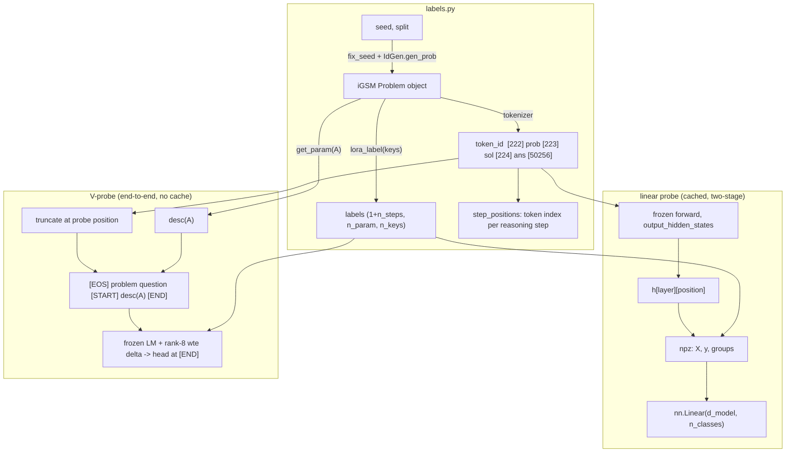

# Probing the iGSM model: linear probes & V-probes

Reference for `src/probe/`. For a beginner-friendly version with more conceptual unpacking, see
[probe_guide_beginner.md](probe_guide_beginner.md).

Reproduces the probing methodology of *Physics of LMs Part 2.1* (https://dx.doi.org/10.2139/ssrn.5250629), §4.1,
against our GPT2-12-12+RoPE trained on iGSM-med.

## Module map

| File | Role |
|---|---|
| `src/probe/labels.py` | Regenerate a problem from `(seed, split)`, extract ground-truth labels from iGSM's own `Problem.lora_label`, plus token-alignment metadata (`sol_bos_index`, `step_positions`). |
| `src/probe/extract.py` | Stage A of the **linear probe**: frozen forward passes, cache `(X, y, groups)` per layer to `.npz`. |
| `src/probe/probe.py` | Stage B of the **linear probe**: `nn.Linear` on cached activations, group-split train/val, MCC. |
| `src/probe/vprobe.py` | **V-probe** (paper §4.1): frozen LM + rank-8 embedding delta + linear head; trains through the model (no cache). |
| `src/probe/run.py` | Typer CLI: `extract`, `train`, `vprobe`. |

For what the test suite actually verifies (and the model-dependent code it deliberately does
*not* cover), see [../tests/README.md](../tests/README.md).

## Data flow



## Ground-truth labels

Labels are generated by iGSM's `Problem` class (`iGSM/math_gen/problem_gen.py`).

- `Problem.lora_label(keys)` -> `(1 + n_steps, n_param, n_keys)` for
  `nece, known, can_next, nece_next, val`. Axis 0 = reasoning step (row `i_` = state after
  the first `i_` solution sentences); axis 1 = `all_param`.
- `Problem.lora_label2('dep')` -> `(n_param, n_param)` pairwise dependency matrix.

A parameter is a 4-tuple `(l, i, j, k)` over the layered category hierarchy
(`ln[i]` = layer-i category, `N[i][j]` = node j in layer i):

- `l=0` **instance**: "how many `N[i+1][k]` does each `N[i][j]` have" (direct edge).
- `l=1` **abstract**: "how many `ln[k]` in total does `N[i][j]` have" (aggregate; forces
  multi-hop reasoning). `all_param` enumerates *every* candidate, mentioned or not.

Step alignment is verified against iGSM source: with `be_shortest=True` (default), solution
sentences are emitted in `topological_order` — the same order `lora_label` iterates — and each
sentence ends in a standalone `.` (token 13). `_solution_step_positions` asserts the counts
match, so tokenizer drift fails loudly.

## Probe positions (paper §4.1)

- `nece(A)`, and `dep(A,B)` for pq-format: end of question ≈ our `sol_bos_index`.
  (`dep` for the paper is end of *problem description*; that position is not yet cached.)
- `known/can_next/nece_next/value`: end of every solution sentence = `step_positions[i_]`.

## Linear probe vs V-probe

The plain linear probe reads one hidden state and cannot condition on *which* parameter is
queried — with the shared `sol_bos` read position it is **degenerate by construction** (one
vector, many labels) and serves as the baseline. The V-probe injects the query into the
input:

```
[EOS] <problem+question tokens> [START] <desc(A) tokens> [END]
                                                          ^ read last-layer h here
```

`[START]=225, [END]=226`: byte-fallback ids that cannot appear in ASCII iGSM text (verified:
0 occurrences in 200 problems). Note they are *not* untrained: weight tying trains all
never-occurring rows toward "never the next token", collapsing them to near-identical vectors
(norm 1.151 for every unused row in our checkpoint vs 1.5–2.9 for the sentinels). The rank-8
embedding delta exists precisely to give these (and the probe's input distribution shift)
usable representations. See the beginner guide for the rank-8 discussion.

Trainables: linear head + `delta_a (V×8, zero-init) @ delta_b (8×d, N(0,0.02))`. The LM is
frozen and kept in eval mode (dropout off) even during probe training. Zero-init on `delta_a`
makes step 0 exactly the pretrained model.

**Controls** (both required for interpretation):
- majority-guess accuracy (`acc_majority`), reported per split;
- the identical procedure on a random-init LM (`--random-model`). Evidence = pretrained −
  random gap, not the absolute number.

## Splitting: group, not row

Rows are clustered by problem (identical read positions for the linear probe; shared prefix
for the V-probe). Row-level splits leak: identical/correlated vectors land in both train and
val, and `*_val` measures memorisation. Both trainers therefore split by **problem seed**
(`groups` in the npz; `VProbeRow.group`). An npz without `groups` falls back to a row
split with a loud warning.

## Resource use (read before running the V-probe)

The trainable embedding delta sits at the **bottom** of the LM, so backprop must traverse all
12 blocks and autograd stores every block's activations for the whole batch. This — not the
0.41 M trainable params — is the dominant cost.

**Windows-specific hazard:** exhausting VRAM does *not* raise OOM. WDDM silently spills to
"shared GPU memory" (system RAM) and the machine thrashes over PCIe. The symptom is batch
times creeping up (we observed 1.4 s → 15.6 s/batch) while system RAM climbs past 12 GB and
the desktop goes unresponsive. Mitigations, all on by default:

| guardrail | effect |
|---|---|
| `apply_memory_guardrails` (`--vram-fraction 0.85`) | `set_per_process_memory_fraction` — allocator refuses to grow past the cap and raises a **clean OOM** instead of spilling into RAM |
| gradient checkpointing (`--grad-checkpointing`, default on) | recompute block activations in backward; ~30% slower, large VRAM saving |
| bf16 autocast | halves activation bytes (3090 has native bf16) |
| length bucketing | batches group similar-length rows → peak tracks the *average* length, not the worst case; also stops allocator fragmentation (the cause of the creeping batch times) |
| `MAX_SEQ_LEN = 1024` | drops pathological rows that would set a whole batch's memory |
| `--batch-size 8` (default) | the main VRAM knob |

Measured after fixes: **peak 3.56 GiB VRAM**, flat batch times, no system-RAM spill.
`peak_vram_gib` is reported in the metrics line of every run — watch it.

If you OOM: lower `--batch-size` first. Do **not** raise `--vram-fraction` above ~0.9; the
cap is what keeps a bad run from taking the desktop down.

## Metrics

* MCC (Matthews correlation):  
  * 0 = chance regardless of class balance or `n_classes`,  
  * 1 = perfect, comparable across layers and probe targets.  
* `*_train` vs `*_val` gap = memorisation check. V-probe additionally reports plain accuracy for comparability with the paper's Figure 7 (which reports accuracy vs majority-guess).

## Running

Run tests
```bash
uv run python -m pytest .\tests\ -q
```

Smoke test (~30 s on GPU; validates the full path):

```bash
uv run python -m src.probe.run vprobe --model-path final_models/gpt2-rope-igsm/final --n-problems 16 --epochs 1 --batch-size 16
```

Full nece V-probe + control. **Always pass `--balance-classes`** for `nece`: the ~80/20
imbalance otherwise lets the probe collapse to the majority class (loss parks at the prior's
entropy, MCC ~0 -- the failure mode in the first runs). Keep `--n-problems` and `--seed`
identical between the pretrained run and its control so the pretrained−random val-MCC gap is
apples-to-apples. Defaults are memory-safe; the 24 GB box has headroom for `--batch-size 16`
(the 300/5000-problem runs peaked at 3.8/8.4 GiB -- watch `peak_vram_gib`).

```bash
uv run python -m src.probe.run vprobe --model-path final_models/gpt2-rope-igsm/final --n-problems 500 --epochs 20 --batch-size 24 --balance-classes --seed 0 > results/vprobe_nece_pretrained.log
```
```bash
uv run python -m src.probe.run vprobe --random-model --n-problems 500 --epochs 20 --batch-size 24 --balance-classes --seed 0 > results/vprobe_nece_random.log
```

Tuning knobs now exposed on the CLI: `--epochs`, `--lr`, `--weight-decay`, `--rank`,
`--batch-size`, `--balance-classes`. With balancing, expect the loss to *start higher*
(~0.69, the balanced-prior entropy, not the ~0.46 you saw unweighted) and then fall; if it
parks at ~0.69 the probe still isn't extracting signal. Diagnose on `mcc_train` first (can it
fit at all?) before reading `mcc_val`. The zero-init delta learns slowly through 12 frozen
blocks, so if a single `--lr` stalls, try raising it (e.g. 3e-3) or more epochs.

Linear-probe baseline (two stages). The linear probe reads one shared position and is
degenerate for `nece` by construction (see above) -- it is the baseline, not expected to
work; `--balance-classes` is exposed here too:

```bash
uv run python -m src.probe.run extract --model-path final_models/gpt2-rope-igsm/final --layer 6 --n-problems 1000 --out data/probe/nece_l6.npz
uv run python -m src.probe.run train --data data/probe/nece_l6.npz --balance-classes
```

## Viewing results

**Current state: stdout/log files only.** Each run prints one metrics line
(`acc_val, mcc_val, acc_majority, acc_train, mcc_train, n_train, n_val`); redirect to
`results/*.log` and compare pretrained vs random-model lines manually.

**Not yet built** (planned, per the inspect-style review idea): an `inspect_ai` task where
each sample = one problem, with per-parameter name / label / prediction in sample metadata
and a trivial agreement scorer, browsable via `inspect view`. Prerequisite: persist
per-row predictions keyed by `(seed, param)` — the `groups` array already provides the seed
half. Until then there is no per-example drill-down, only aggregate metrics.

## Known gaps / TODOs

- Only `nece` is implemented for the V-probe (`build_vprobe_rows` asserts on other targets);
  step-dependent targets need rows per `(problem, param, step)` with prefixes truncated at
  `step_positions[i_]`.
- `dep(A,B)` needs the end-of-problem-description position and two-description inputs.
- No per-example result viewer (see above).
- Extension ideas parked: probing never-mentioned parameters (labels already support it);
  per-name-family probes with name-swap transfer (linear-probe alternative to V-probes).
