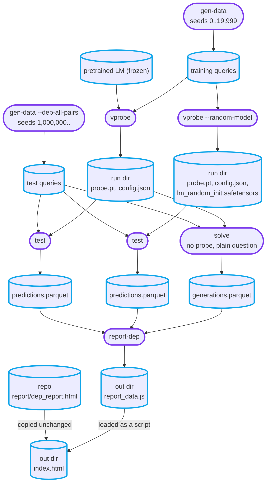
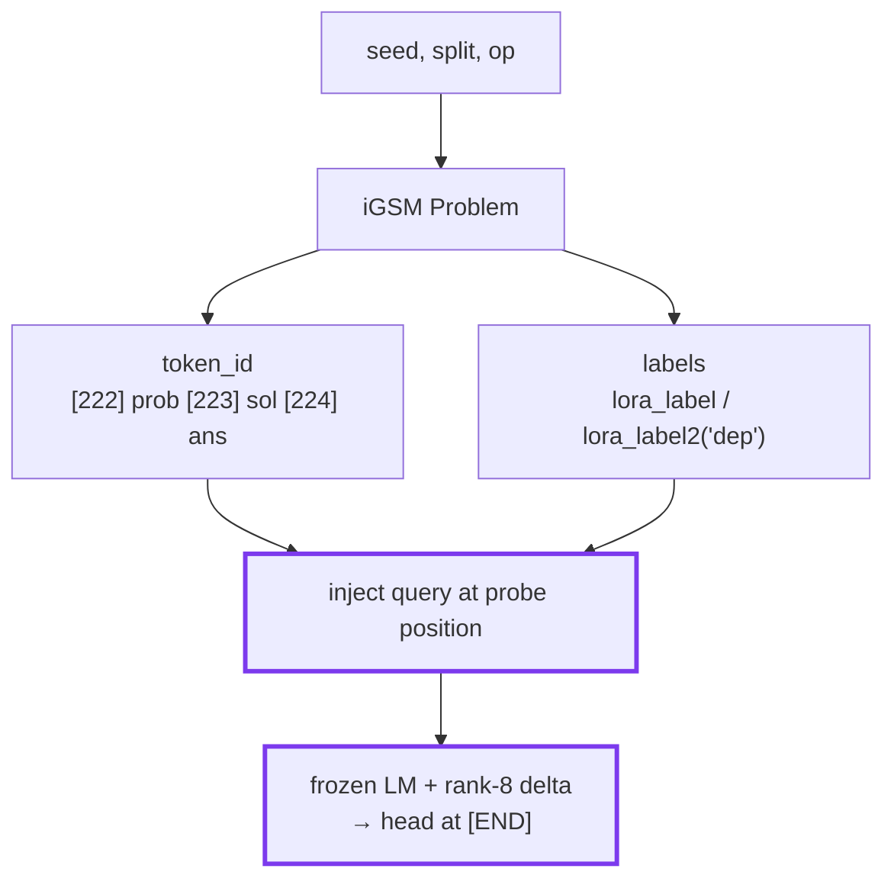

# Probing the iGSM model: V-probes

Reference for `src/probe/`. Reproduces the probing methodology of *Physics of LMs Part 2.1*
(https://dx.doi.org/10.2139/ssrn.5250629), §4.1, against our GPT2-12-12+RoPE trained on iGSM-med.

## TL;DR: the `dep(A, B)` pipeline

Eight commands, start to finish. Training draws problem seeds `0..19999`; the eval set starts at
1,000,000, so the two ranges don't overlap. Nothing checks this for you.

**1. Training queries.** ~2.5 min on 8 workers; 9.91 queries/problem, so ~198k.

```bash
uv run python -m src.probe.run gen-data --target dep --n-problems 20000 --seed-start 0 --workers 8 --out data/probe/vprobe_dep_train_20k
```

**2. Train on the pretrained model.**

```bash
uv run python -m src.probe.run vprobe --target dep --model-path models/gpt2-igsm-med --data data/probe/vprobe_dep_train_20k --epochs 1 --batch-size 64 --no-grad-checkpointing --seed 872650
```

**3. Train the random-init control.** Same data and same `--seed`, so the split is identical.

```bash
uv run python -m src.probe.run vprobe --target dep --random-model --data data/probe/vprobe_dep_train_20k --epochs 1 --batch-size 64 --no-grad-checkpointing --seed 872650
```

**4. Eval queries.** Disjoint seeds, all ordered pairs, difficulty spread evenly.

```bash
uv run python -m src.probe.run gen-data --target dep --dep-all-pairs --uniform-difficulty --n-problems 230 --seed-start 1000000 --workers 8 --out data/probe/vprobe_dep_eval_230
```

**5. and 6. Evaluate both probes.** Each writes `<run-dir>/test_<dataset>/{predictions.parquet,metrics.json}`.

```bash
uv run python -m src.probe.run test --run-dir trained_probes/<pretrained-run> --data data/probe/vprobe_dep_eval_230
```

```bash
uv run python -m src.probe.run test --run-dir trained_probes/<random-run> --data data/probe/vprobe_dep_eval_230
```

**7. Let the model solve the problems.** Optional. No probe tokens, no probe; just the plain
question, model's own solution, and whether it is right. Writes
`<run-dir>/test_<dataset>/{generations.parquet,generations.json}`.

```bash
uv run python -m src.probe.run solve --run-dir trained_probes/<pretrained-run> --data data/probe/vprobe_dep_eval_230 --n-problems 230
```

**8. Interactive report.** Shows the solutions from step 7 if they are there.

```bash
uv run python -m src.probe.run report-dep --pretrained-run trained_probes/<pretrained-run> --random-run trained_probes/<random-run> --data data/probe/vprobe_dep_eval_230 --out results/probes/<dep_eval_230> --n-problems 230
```

`test` and `solve` read `--model-path` from the run's own `config.json`, so steps 5–7 take no
model arguments; the random control's transformer is its saved `lm_random_init.safetensors`, not
a re-seeded rebuild (see "Testing a trained probe" below).

### Why these settings

| flag | value | reason |
|---|---|---|
| `--epochs` | 1 | every query seen exactly once; buy signal with more problems, not more passes |
| `--batch-size` | 64 | ~2,480 steps/epoch at 20k problems; larger starves the run of steps |
| `--no-grad-checkpointing` | off | checkpointing costs ~30% compute for memory a ≥40 GB GPU doesn't need. On a small card, drop the flag and lower `--batch-size` instead |
| `--vram-fraction` | 0.85 (default) | fraction of the card's **total**. On a shared card, change it to your actual budget |
| `--balance-classes` | omitted | dep's balanced sampling is already ~50/50 |
| `--model-path` on `gen-data` | omitted | recorded in `metadata.json` and never read back; queries are token ids, model-independent, and the same dataset feeds both probes |

### Sizing

`train queries ≈ n_problems × 9.91 × 0.8` (the other 20% of *problems* go to val). Measured over
300 problems on the `test` split: mean 9.91 queries/problem (min 6, max 10), positive rate 0.500.

| `--n-problems` | queries | train | val | steps/epoch @ 64 |
|---|---|---|---|---|
| 500 | ~4,955 | 3,964 | 991 | 62 |
| 5,000 | ~49,550 | 39,640 | 9,910 | 620 |
| 20,000 | ~198,200 | 158,560 | 39,640 | 2,478 |

`--dep-all-pairs` is a different scale entirely — mean 333 queries/problem (median 240, max
1,806), positive rate 0.200. It is for eval only.

## Module map

| File | Role |
|---|---|
| `labels.py` | Regenerate a problem from `(seed, split, op)`; ground-truth labels from `Problem.lora_label`; token-alignment metadata (`sol_bos_index`, `step_positions`, `problem_desc_end_index`). |
| `build_queries.py` | One problem seed → labelled token sequences; owns each target's input layout and read position. |
| `data.py` | Offline query datasets: multiprocess generation into parquet shards + metadata (`gen-data` CLI). |
| `vprobe.py` | The probe: frozen LM + rank-8 embedding delta + linear head at `[END]`; save/load of the trainable parts and the LM they pair with. |
| `vprobe_train.py` | Training loop: group split, length-bucketed batches, epoch loop, reported metrics. |
| `evaluate.py` | Test-time evaluation: rebuild a saved probe from its run dir, predict on a held-out offline dataset, save per-query predictions + metrics into the run dir. |
| `solve.py` | The same problems without any probe: the model writes a solution, iGSM's `true_correct` scores it. |
| `report_dep.py` | Builds the `dep(A, B)` report's data (`report_data.js`) and copies the UI beside it; dependency graph of predictions vs ground truth, pretrained/random toggle, confusion matrices. |
| `report/dep_report.html` | That UI: one static page, edited directly, that reads whatever `report_data.js` sits next to it. |
| `run.py` | Typer CLI: `gen-data`, `vprobe`, `test`, `solve`, `report-dep`. |

Test coverage (and the model-dependent code it deliberately skips): [../tests/README.md](../tests/README.md).

## Data flow

### The pipeline (TL;DR commands as a chart)

Rounded boxes are commands, cylinders files. Everything downstream of `gen-data` addresses
problems by seed, so any step can regenerate the problem text it needs.



`report-dep` generates only `report_data.js`; `index.html` is the static page copied beside it.
`solve` takes the model from the pretrained run's `config.json`, which is why its solutions land
beside that run's predictions rather than beside the dataset.

### Per problem data flow


* seed is used for random model init.  
  ⚠︎ problem generation uses conscutive seeds from --starting-seed
* split = train/val split (20% of problems for val)  
* op = reasoning step count (1..max_op, default 23)

## Ground-truth labels

From iGSM's `Problem` class (`iGSM/math_gen/problem_gen.py`):

- `lora_label(keys)` → `(1 + n_steps, n_param, n_keys)` for `nece, known, can_next, nece_next, val`.  
  Axis 0 = reasoning step (row `i_` = state after the first `i_` solution sentences),  
  axis 1 = `all_param`.
- `lora_label2('dep')` → `(n_param, n_param)` pairwise dependency matrix.

A parameter is a 4-tuple `(l, i, j, k)` over the layered category hierarchy:

- `l=0` **instance**: how many `N[i+1][k]` each `N[i][j]` has (direct edge).
- `l=1` **abstract**: how many `ln[k]` in total `N[i][j]` has (aggregate; multi-hop).

iGSM's `all_param` enumerates every candidate, named in the text or not; `labels.named_params`
narrows it to the text-grounded ones and every label array is narrowed with it, so one indexing
serves `labels`, `nece`, `dep()` and a query's `param_a`/`param_b`.

Step alignment: solution sentences follow `topological_order` (the order `lora_label` iterates)
and each ends in a standalone `.` (token 13); `_solution_step_positions` asserts the counts
match, so tokenizer drift fails loudly.

## Probe positions (paper §4.1, Figure 13)
- `nece(A)`: end of the question = `sol_bos_index`.
- `dep(A,B)`: end of the **problem description**, before the question (the question tokens are
  dropped). Position from `problem_desc_end_index`, which asserts token alignment.
- `known/can_next/nece_next/value`: end of each solution sentence = `step_positions[i_]`.

## Query layout

The probe injects the query into the input, so it can condition on *which* parameter is asked
(`--target` picks the task):

```
nece(A):   [EOS] <problem+question tokens>  [START] <desc(A)> [END]
dep(A,B):  [EOS] <problem tokens, no ques.> [START] <desc(A)> [MID] <desc(B)> [END]
                                                        read last-layer h here ⤴︎
```

`[START]=225, [END]=226, [MID]=227` are byte-fallback ids that never appear in ASCII iGSM text
(0 occurrences in 300 problems). They are *not* untrained: weight tying collapses every
never-occurring row toward a single "never the next token" vector, so the rank-8 delta exists to
give the markers usable representations.

**Query sampling:** a problem's queries are highly correlated, so `--max-queries` (default 10,
the paper's Appendix E rule) caps each problem's contribution, drawn uniformly without
replacement and seeded by the problem seed. `nece` samples parameters directly; `dep` splits the
budget evenly per class, making the dataset ~50/50 (`acc_majority ≈ 0.5`) instead of the pair
matrix's natural ~17% positive — so dep does *not* need `--balance-classes`. A positive-poor
problem then yields fewer than 10 queries rather than filling up with negatives; `--unbalanced`
is the paper-literal rule (uniform over all pairs) and does need `--balance-classes`.

**Trainables:** linear head + `delta_a (V×8, zero-init) @ delta_b (8×d, N(0,0.02))`. The LM
stays frozen and in eval mode; zero-init `delta_a` makes step 0 exactly the pretrained model.

**Controls** (both needed to interpret a score): majority-guess accuracy (`acc_majority`), and
the same procedure on a random-init LM (`--random-model`). Evidence = pretrained − random gap.

## train/val Splitting: by problem, not by query
Validation data contains different problems than training data, not just different queries.
Training splits by **problem seed** (`ProbeQuery.group`).

## Resource use (read before training)

The embedding delta sits at the **bottom** of the LM, so backprop traverses all 12 blocks and
autograd stores every block's activations — this, not the 0.41 M trainable params, is the cost.
On Windows, exhausting VRAM does *not* raise OOM: the driver silently spills into system RAM and
thrashes over PCIe until the desktop hangs. Guardrails, all on by default:

| guardrail | effect |
|---|---|
| `--vram-fraction 0.85` | allocator refuses to grow past the cap → clean OOM instead of spilling |
| `--grad-checkpointing` | recompute block activations in backward; ~30% slower, big VRAM saving |
| bf16 autocast | halves activation bytes |
| length bucketing | groups similar-length queries → peak tracks average length; avoids fragmentation |
| `MAX_SEQ_LEN = 1024` | drops pathological queries that would set a batch's memory |
| `--batch-size 8` (default) | the main VRAM knob |

Peak with the defaults is 3.56 GiB, and `peak_vram_gib` is in every run's metrics — watch it. If
you OOM, lower `--batch-size` first; don't raise `--vram-fraction` above ~0.9.

**Length bucketing vs. batch diversity.** A problem's queries are near-equal in length, so a
*stable* length sort keeps them adjacent and one problem can fill a batch; shuffling the indices
first breaks those ties at no padding cost. At 300 problems × the 10-query cap, batch size 8
(`scripts/debug/batch_composition.py`):

| strategy | distinct problems / batch | padded tokens / batch | padding waste |
|---|---|---|---|
| no bucketing | 7.93 | 790 | 21.5% |
| stable sort | 5.12 | 620 | 0.1% |
| pre-shuffled (used) | 7.41 | 620 | 0.1% |

The gap widens with queries per problem — pass a larger second argument to the script to see the
uncapped regime, where the stable sort collapses to ~1.9.

## Metrics

- **MCC** (Matthews correlation): 0 = chance regardless of class balance, 1 = perfect;
  comparable across layers and targets.
- `*_train` vs `*_val` gap = memorisation check. Plain accuracy is also reported, for
  comparability with the paper's Figure 7.

## The model: download & loading (read first)

Use the HuggingFace checkpoint [m6rtine/gpt2-igsm-med](https://huggingface.co/m6rtine/gpt2-igsm-med)
(~501 MB), into the gitignored `models/`:

```bash
uv run python -c "from huggingface_hub import snapshot_download; snapshot_download('m6rtine/gpt2-igsm-med', local_dir='models/gpt2-igsm-med')"
```

Pass `--model-path models/gpt2-igsm-med` to the commands below. Do **not** use `AutoModel` — it
builds a stock GPT-2 with absolute positions and no RoPE; the probe CLIs load through our
`GPT2LMHeadModelWithRoPE` automatically.

The RoPE `inv_freq` buffers are only correct when loaded *from the checkpoint*, so `load_lm` /
`load_frozen_model` verify all 12 against the formula on load and raise on mismatch — a bad
checkpoint fails loudly. (Background: [project_log.md](project_log.md), "`inv_freq` is garbage
after `from_pretrained`".)

## Running

```bash
uv run python -m pytest .\tests\ -q                                    # tests
uv run python -m src.probe.run vprobe --model-path models/gpt2-igsm-med \
    --n-problems 16 --epochs 1 --batch-size 16                         # smoke (~30 s)
```

### nece(A)

**Always pass `--balance-classes`** (the ~80/20 imbalance otherwise collapses the probe to the
majority class, MCC ~0). Keep `--n-problems` and `--seed` identical between a run and its control.

**Train the probe**
```bash
uv run python -m src.probe.run vprobe --target nece --model-path models/gpt2-igsm-med --n-problems 20000 --epochs 1 --batch-size 24 --balance-classes --seed 872650
```
**Train the random-model control**
```bash
uv run python -m src.probe.run vprobe --target nece --random-model --n-problems 20000 --epochs 1 --batch-size 24 --balance-classes --seed 872650
```

### dep(A, B)

Same shape as nece, but **no `--balance-classes`** (balanced by construction). Both targets cap
each problem at `--max-queries` (default 10), so a given `--n-problems` yields a comparable
query count either way.

**Train the probe**
```bash
uv run python -m src.probe.run vprobe --target dep --model-path models/gpt2-igsm-med --n-problems 20000 --epochs 1 --batch-size 24 --seed 872650
```
**Train the random-model control**
```bash
uv run python -m src.probe.run vprobe --target dep --random-model --n-problems 20000 --epochs 1 --batch-size 24 --seed 872650
```

For query counts that avoid overfitting, generate offline first (multiprocess) and pass `--data`
instead of `--n-problems`:

```bash
uv run python -m src.probe.run gen-data --target dep --n-problems 20000 --workers 8 --model-path models/gpt2-igsm-med --out data/probe/vprobe_dep_test_20k
```
```bash
uv run python -m src.probe.run vprobe --target dep --model-path models/gpt2-igsm-med --data data/probe/vprobe_dep_test_20k
```

Tuning knobs: `--lr`, `--weight-decay`, `--rank`, `--batch-size`, `--balance-classes`.
`--epochs` defaults to 1 so every query is seen exactly once — more data is cheap, repeating it
is not. Diagnose on `mcc_train` first (can it fit at all?) before `mcc_val`; the zero-init delta
learns slowly through 12 frozen blocks, so if `--lr` stalls, raise it (e.g. 3e-3).

## Viewing results

Each `vprobe` run creates `trained_probes/<timestamp>_<name>/` (printed as `run dir: ...`)
holding `config.json` (params + git commit), `train.log`, `metrics.json` (final + per-epoch
history), and `probe.pt` (trainable head + delta only; reload with `vprobe.load_vprobe`).
Compare a run's `metrics.json` against its random-model control manually. `trained_probes/` is
gitignored.

## Testing a trained probe (dep)

Commands: TL;DR steps 4–7.

`mcc_val` is split off the probe's own training data — 20% of its problems, so the same seed
range and the same balance. Command 4 builds a separate dataset instead: disjoint seeds, and all
valid queries per problem rather than a sample (sizes in the TL;DR). Expect test MCC below
`mcc_val`.

**Random control:** `vprobe` saves the control's exact weights as `lm_random_init.safetensors`
in its run dir (~478MB), and `test` loads them back. Rebuilding from `--seed` instead would
break as soon as the init code or the `transformers` version changes.

### Difficulty

The grid is columns = `n_op`, rows = problems at that difficulty, from the dataset's first
`--n-problems`.

- `--uniform-difficulty` pins each problem's op, cycling `1..max_op`, so every op — and every
  prefix — fills evenly. Costs ~1.8x. Without it, ops skew low.
- `--max-op` defaults to 23 (the paper's out-of-distribution range; pretraining used 15). op>15
  is naturally rare (~10%), so raise it together with `--uniform-difficulty`. Say in any writeup
  that op 16–23 is **outside the model's training range**: low scores there measure length
  generalization, not a probe failure.

An op-pinned problem differs from what the seed yields unpinned, so op is part of a problem's
identity. Datasets record it per query (`n_op`); `report-dep` feeds it back and errors out
rather than draw a graph beside another problem's text.

### The report

`--out` is a directory of two files that must stay together: `index.html` (the UI, copied from
`src/probe/report/dep_report.html`) and `report_data.js`. Data is a `.js` assignment rather than
`.json` so the page works opened from disk, where a browser loads a sibling script but refuses
to `fetch` one. Default: `results/probes/<date>_<time>_dep`, gitignored.

Parameters sit on a circle, each tested pair a directed edge A→B ("A depends on B"). Line style
= true label (solid: dependency, dashed: none), colour = correctness (green right, red wrong,
wrong also marked ×). True negatives start hidden. Hover a node to isolate its pairs, click to
pin; a toggle switches pretrained ↔ random control; confusion matrices below, per problem or
overall. The problem is picked in two steps: a strip of difficulties, then the seeds generated at
that difficulty. Two plots over difficulty close the page, both over the whole test set: the
model's solve rate (strict, and counting the final answer alone), and each probe's MCC against
the true labels.

With solutions from `solve`, the problem text panel also toggles iGSM's reference solution ↔
what the model wrote, badged with iGSM's strict verdict (answer, every calculation and every
dependency), and the seed dots fill green (solved) or red-× (not). Without them the page shows
the reference solution alone and leaves the solve-rate plot empty.

## Known gaps / TODOs

See [backlog.md](backlog.md) for the live list.
