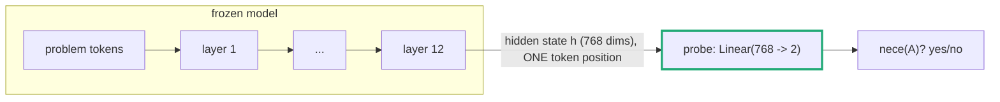
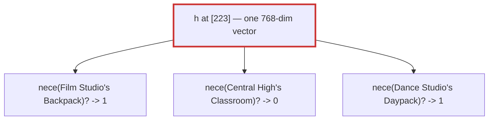
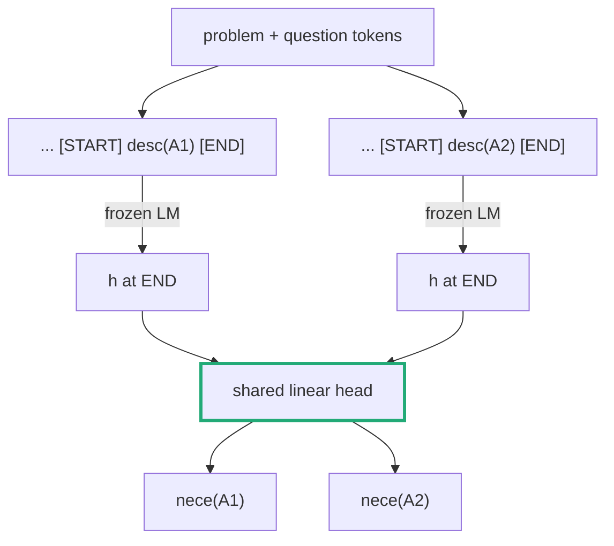
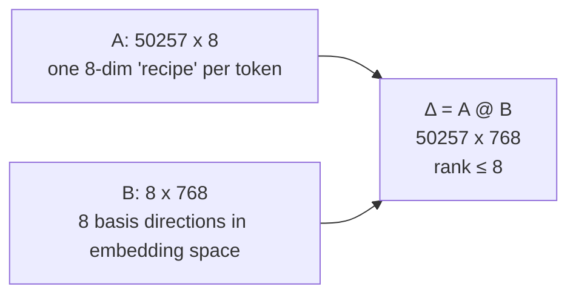
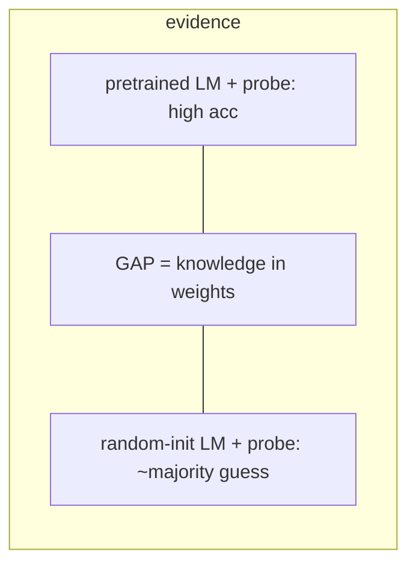
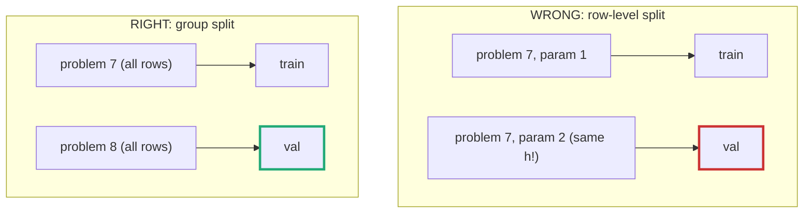
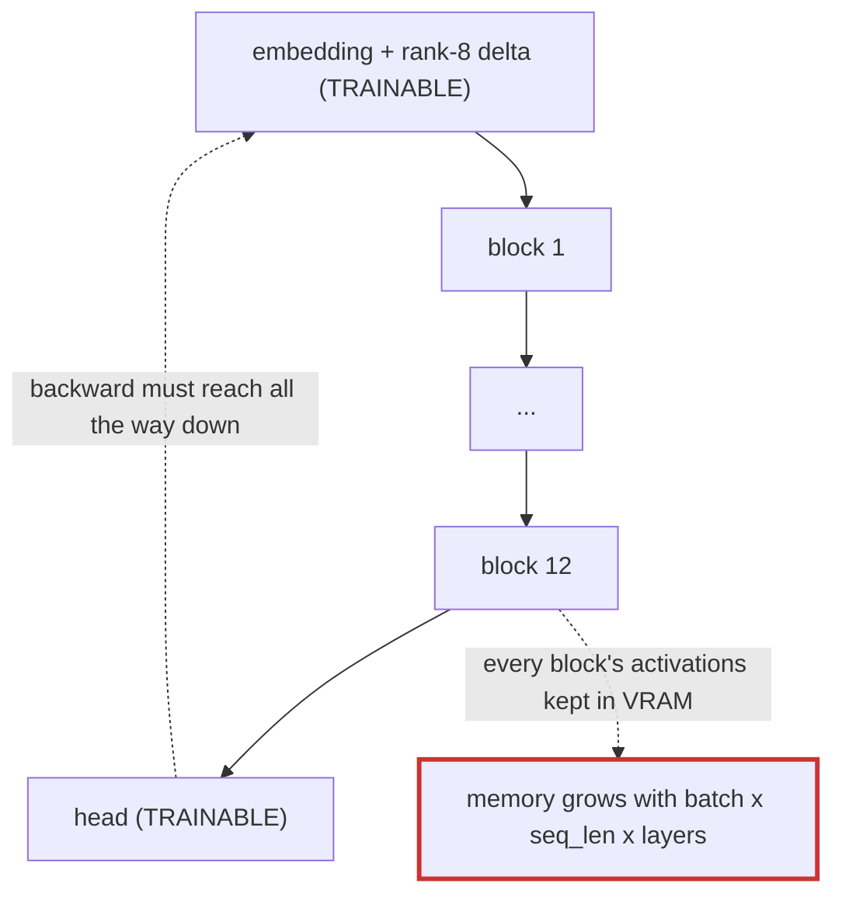

# Probing, explained from the ground up

Companion to [probe_guide.md](probe_guide.md) with the concepts unpacked. Read this one
first; switch to the reference doc when you just need commands or file names.

## 1. What a probe is actually asking

The model reads a math problem. Somewhere in its 12 layers × 768 dimensions of hidden
states, does it *represent* facts like "parameter A will be needed for the answer"?

A **probe** is a deliberately tiny classifier trained to read such a fact out of a hidden
state. The logic is:

> If a *single linear map* can decode the fact from the residual stream, the model
> represents that fact (approximately) as a direction in activation space. The probe
> doesn't create the knowledge — it's too small to — it can only *find* it.

That "too small to create knowledge" clause is load-bearing. Everything below (rank
restrictions, random-model controls, baselines) exists to keep it true or to check it.



## 2. Why the simple version fails for our questions

A linear probe maps **one vector → one answer**. But `nece(A)` is a question *about a
specific parameter A*, and one problem has ~6–44 candidate parameters. If we read the
hidden state at one fixed position (say the `[223]` solution-start token), we get **one
vector** but need **many different answers**:



No function — linear or not — maps the same input to different outputs. Our
`probe.py` linear probe on the shared `sol_bos` position is therefore **degenerate by
construction**. We keep it as the baseline that *demonstrates* this (expect MCC ≈ 0).

The fix: the probe must be told *which* A we're asking about. The paper's answer is to put
A **into the input**.

## 3. V-probing: append the question to the prompt

Take the problem tokens up to the probing position, then append the parameter's description
wrapped in two special marker tokens, and read the hidden state at the closing marker:

```
[EOS] <problem> <question> [START] each Film Studio's Backpack [END]
                                                                ^^^^^
                                            read last-layer h here, classify
```

Now different queries are different inputs — the degeneracy is gone, and one probe serves
*all* parameters of *all* problems (no per-A retraining; A is data, not architecture).



### The catch: the model has never seen this input format

`[START]`/`[END]` are token ids 225/226 — byte-fallback tokens that cannot occur in ASCII
iGSM text. We verified something surprising about them in our checkpoint: they are **not**
random-init leftovers. Because GPT-2 ties its input embedding to its output head, every
never-occurring token still gets trained — by the softmax constantly pushing down its
"probability of being the next token". All unused tokens receive essentially the *same*
signal, so their embeddings collapse to near-identical vectors (we measured identical norms,
1.151, for every unused row). To the model, `[START]` and `[END]` look like *the same
meaningless word*.

So the probe needs a way to give these tokens (and this unfamiliar prompt format) usable
input representations — without unfreezing the model. That's the **rank-8 embedding
update**.

## 4. Rank-8 updates, from scratch

### What matrix rank is

The **rank** of a matrix is the number of linearly independent rows (equivalently,
columns). Geometrically: a rank-r matrix, seen as a collection of row-vectors, has all its
rows living inside a single r-dimensional subspace — every row is a linear combination of
just r basis vectors.

A rank-r matrix of shape `(V × d)` can always be written as a product of two thin matrices:

```
Δ (V × d)   =   A (V × r)   @   B (r × d)
```



Read it row-wise: **B's 8 rows are 8 direction vectors in the model's 768-dim embedding
space; A's row for token t holds 8 numbers saying how much of each direction to add to
token t's embedding.** Every token's adjustment is mixed from the same 8 ingredients.

The new embedding used by the V-probe is `wte + Δ` — the original (frozen) table plus this
low-rank correction. We initialise A to zeros, so at step 0 the correction is exactly zero
and training starts from the unmodified pretrained model.

### Why restricting the rank is the *point*, not a compromise

Count parameters:

| update | trainable params |
|---|---|
| full-rank Δ (V × d) | 50257 × 768 ≈ **38.6 M** |
| rank-8 (A and B) | (50257 + 768) × 8 ≈ **0.41 M** |

38.6 M is more than half a full GPT-2 layer. A probe with a full-rank embedding update could
plausibly *learn the task itself* — memorise what iGSM parameter descriptions mean and
compute necessity from scratch — and then a high accuracy would tell us nothing about the
pretrained model. The whole probing argument collapses.

The rank restriction caps how much *new capability* the probe can smuggle in, while still
being enough for what it legitimately needs to do:

1. give `[START]`/`[END]` distinguishable, useful embeddings (2 tokens — needs 2 directions);
2. mildly re-shade the tokens that appear in descriptions so the frozen model routes the
   query correctly (a small, shared adjustment — a few directions).

Neither job needs 768 independent degrees of freedom per token; 8 shared directions
suffice. And crucially, the *residual doubt* ("could even 0.4 M params have learned the task
alone?") is answered empirically, not by argument: run the identical probe on a
**randomly-initialised** transformer. Whatever accuracy that reaches is what the probe can
do without any pretrained knowledge. In the paper (Figure 7), random-model probing sits at
the majority-guess baseline while pretrained-model probing sits near 99% — that *gap* is the
finding.



(Same idea as LoRA finetuning, opposite intent: LoRA picks low rank to *add* capability
cheaply; V-probing picks low rank to *bound* the capability added, so measurement stays
measurement.)

## 5. Where the labels come from (no manual labelling)

iGSM builds each problem from a dependency graph, and its `Problem` object will answer our
probe questions directly — `problem.lora_label(['nece', ...])` returns, for every reasoning
step and every candidate parameter, the ground truth for all five tasks. `labels.py` wraps
this: give it `(seed, split)` and it regenerates the problem deterministically and returns
tokens + labels + the token positions where each reasoning step ends.

One subtlety we verified against iGSM's source: the label tensor's "step" axis and the
solution sentences in the token stream follow the *same* order (`topological_order`), so
"state after i solution sentences" lines up with the token where sentence i ends. An assert
in `_solution_step_positions` breaks loudly if that ever stops holding.

## 6. The leakage trap (why we split by problem)

All rows generated from one problem are related — for the linear probe they're literally the
same vector; for the V-probe they share the whole problem prefix. If you shuffle *rows* into
train/val, the val set contains near-copies of training rows and the score measures
memorisation, not generalisation.



Hence the `groups` array (problem seed per row) saved by `extract` and used by both
trainers: whole problems go to train *or* val, never both. The question a probe must answer
is "does this generalise to problems never seen", and only a group split asks it.

## 7. Reading the metrics

Each run prints one line, e.g.:

```
[final_models/...] nece: acc_val=0.6452, mcc_val=0.0000, acc_majority=0.6452, acc_train=0.8211, mcc_train=0.0000, ...
```

- **acc_majority** — what you'd score by always guessing the most common label. Any accuracy
  must be read *relative to this*. (Above: acc_val == acc_majority, i.e. the undertrained
  smoke-test probe learned nothing — the baseline caught it.)
- **mcc** (Matthews correlation) — our headline number: 0 = chance *no matter how imbalanced
  the labels are*, 1 = perfect. Comparable across layers and across probe targets.
- **train vs val gap** — a much higher train score means the probe memorised its training
  problems; distrust the val number's stability and add data/regularisation.
- **pretrained vs `--random-model`** — the actual evidence (section 4).

## 7b. Why the V-probe is memory-hungry (and how we tamed it)

The probe itself is tiny (~0.4 M params). So why did an early run eat 12+ GB of system RAM and
freeze the machine?

Because the trainable embedding delta sits at the **bottom** of the network. To compute its
gradient, backprop has to travel all the way down through all 12 transformer blocks — and
autograd must therefore *remember* every block's activations for every sequence in the batch
until the backward pass consumes them.



On Windows there's a nasty amplifier: when VRAM runs out, the driver does **not** raise an
out-of-memory error. It quietly starts using your system RAM as overflow ("shared GPU
memory") and shuttles data over PCIe. The run doesn't crash — it just gets slower and slower
(we watched batches go 1.4 s → 15.6 s) while RAM fills and the desktop becomes unusable.

Four fixes, all default-on now:

1. **Hard VRAM cap** (`--vram-fraction 0.85`): tells PyTorch's allocator never to exceed 85% of
   the card. Now a too-big run **fails fast with a clean OOM** instead of dragging the whole
   machine down. This is the safety net — don't raise it.
2. **Gradient checkpointing**: instead of storing all 12 blocks' activations, store only the
   block boundaries and *recompute* the insides during backward. Classic time-for-memory trade
   (~30% slower, big memory win).
3. **bf16 autocast**: activations in 16-bit instead of 32-bit — half the bytes, and the 3090
   does bf16 natively.
4. **Length bucketing**: a batch costs `batch_size × longest_row_in_batch`, because everything
   is padded to the longest. Mixing one 500-token row with seven short ones pads them *all* to
   500. Sorting rows by length before batching means peak memory tracks the *average* row, and
   it also stops the allocator from fragmenting across dozens of distinct padded sizes (that
   fragmentation was what made the batch times creep upward).

Result: peak VRAM **3.56 GiB**, flat batch times, no RAM spill. Every run prints
`peak_vram_gib` — keep an eye on it. If you ever OOM, lower `--batch-size` first.

## 8. How to run everything

Smoke test (seconds — checks the whole pipeline, expect chance-level scores):

```bash
uv run python -m src.probe.run vprobe --model-path final_models/gpt2-rope-igsm/final \
    --n-problems 16 --epochs 1 --batch-size 16
```

Real run + its control (minutes each on GPU; always run both):

```bash
uv run python -m src.probe.run vprobe --model-path final_models/gpt2-rope-igsm/final \
    --n-problems 300 --epochs 3 > results/vprobe_nece_pretrained.log 2>&1
uv run python -m src.probe.run vprobe --random-model \
    --n-problems 300 --epochs 3 > results/vprobe_nece_random.log 2>&1
```

Degenerate linear-probe baseline (two stages; expect mcc ≈ 0 — that's the lesson):

```bash
uv run python -m src.probe.run extract --model-path final_models/gpt2-rope-igsm/final \
    --layer 6 --n-problems 300 --out data/probe/nece_l6.npz
uv run python -m src.probe.run train --data data/probe/nece_l6.npz
```

On Windows, if `uv run` trips over the `triton` dependency, invoke
`./.venv/Scripts/python.exe -m src.probe.run ...` directly.

**Result viewing today = these printed lines / log files only.** The per-example browser
(inspect_ai task: click through problems, see each parameter's label vs prediction) is
designed but **not built yet** — it needs per-row predictions persisted with their
`(seed, param)` identity first. See "Known gaps" in the reference doc.
